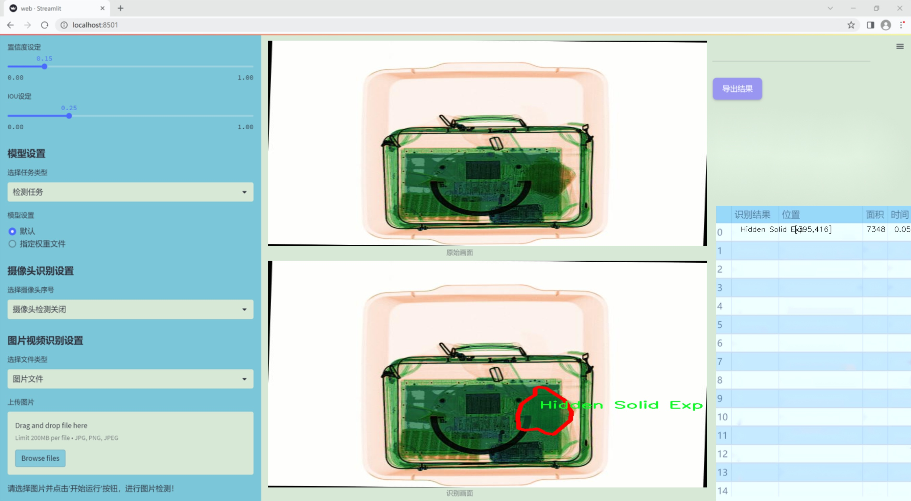
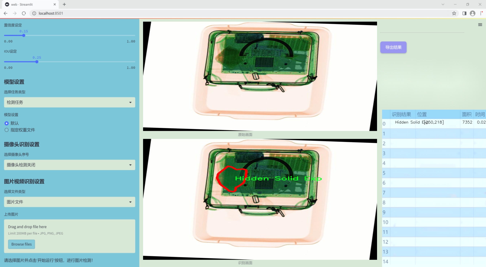
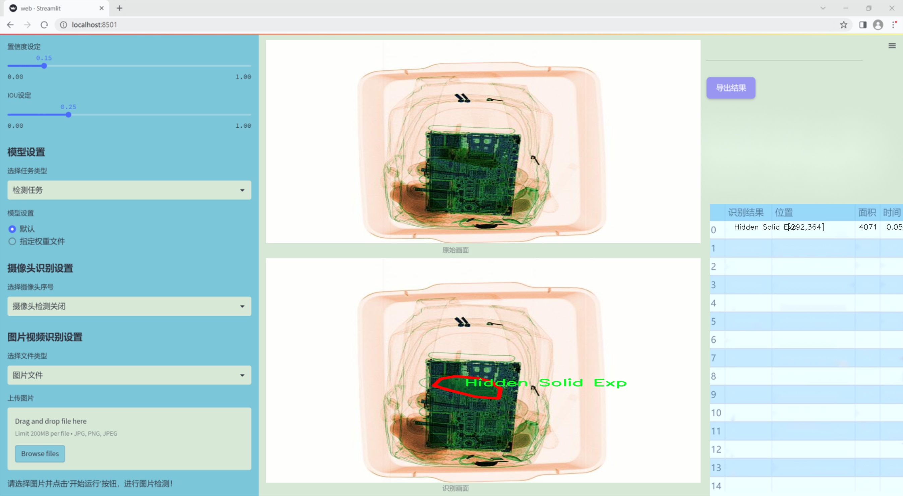
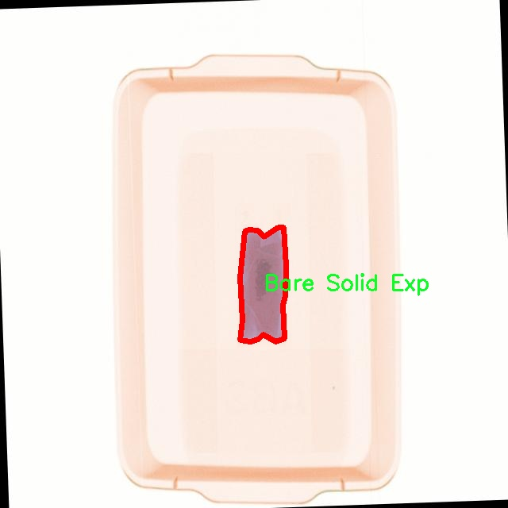
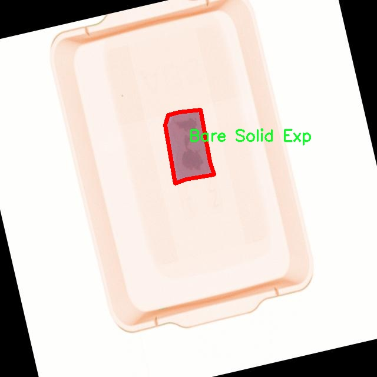
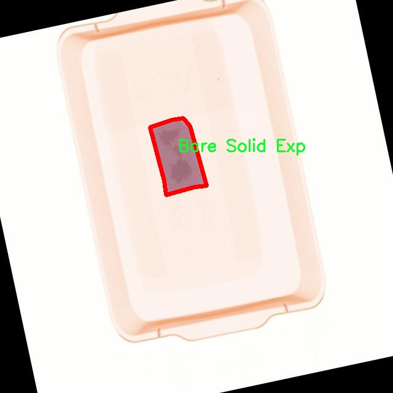
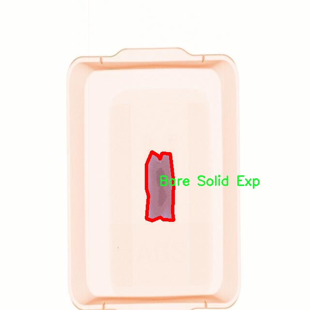
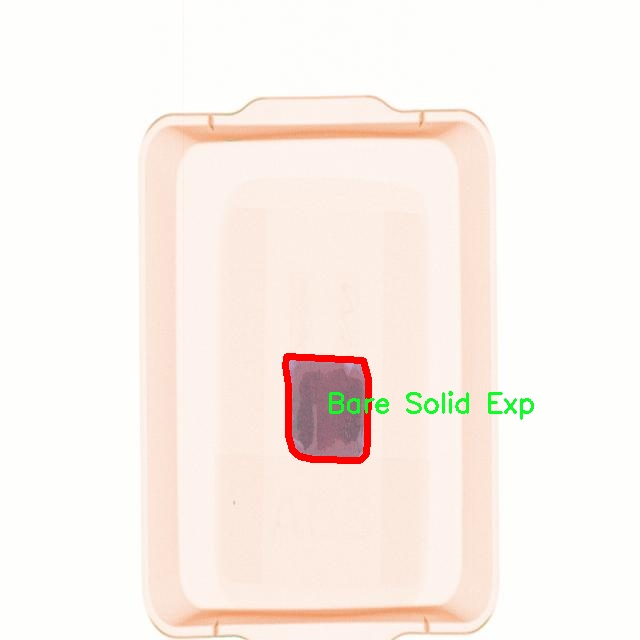

### 1.背景意义

研究背景与意义

随着全球安全形势的日益复杂，安检工作的重要性愈发凸显。特别是在公共场所和交通枢纽，如何有效地检测和识别潜在的爆炸物成为了一个亟待解决的技术难题。传统的安检手段往往依赖于人工检查和简单的物理检测，效率低下且容易受到人为因素的影响。因此，基于计算机视觉的自动化检测系统应运而生，成为提升安检效率和准确性的关键技术之一。

在众多计算机视觉算法中，YOLO（You Only Look Once）系列因其高效的实时目标检测能力而受到广泛关注。YOLOv11作为该系列的最新版本，结合了深度学习的优势，能够在复杂背景下快速、准确地识别和分类多种目标。通过对YOLOv11的改进，我们可以进一步提升其在安检领域的应用效果，尤其是在爆炸物检测方面。

本研究所使用的数据集包含3700张经过精心标注的图像，涵盖了六类不同的爆炸物，包括裸露液体爆炸物、裸露固体爆炸物、隐藏液体爆炸物、隐藏固体爆炸物、正常液体和正常固体。这些数据的多样性和丰富性为模型的训练提供了坚实的基础，使其能够在实际应用中具备更强的适应性和鲁棒性。通过对这些图像的深度学习训练，改进后的YOLOv11模型将能够更准确地识别和分类不同类型的爆炸物，从而在安检过程中提供更为可靠的技术支持。

综上所述，基于改进YOLOv11的安检爆炸物检测系统不仅能够提高安检的自动化水平，还能有效降低人为失误的风险，提升公共安全保障能力。随着技术的不断进步，该系统有望在未来的安检工作中发挥更为重要的作用，为维护社会安全贡献力量。

### 2.视频效果

[2.1 视频效果](https://www.bilibili.com/video/BV1MckXYGEuc/)

### 3.图片效果







##### [项目涉及的源码数据来源链接](https://kdocs.cn/l/cszuIiCKVNis)**

注意：本项目提供训练的数据集和训练教程,由于版本持续更新,暂不提供权重文件（best.pt）,请按照6.训练教程进行训练后实现上图演示的效果。

### 4.数据集信息

##### 4.1 本项目数据集类别数＆类别名

nc: 6
names: ['Bare Liquid Exp', 'Bare Solid Exp', 'Hidden Liquid Exp', 'Hidden Solid Exp', 'Normal Liquid Exp', 'Normal Solid Exp']


该项目为【图像分割】数据集，请在【训练教程和Web端加载模型教程（第三步）】这一步的时候按照【图像分割】部分的教程来训练

##### 4.2 本项目数据集信息介绍

本项目数据集信息介绍

本项目所使用的数据集名为“SSTLabs”，旨在为改进YOLOv11的安检爆炸物检测系统提供强有力的支持。该数据集专注于爆炸物的多样性和复杂性，涵盖了六个主要类别，分别为“Bare Liquid Exp”（裸露液体爆炸物）、“Bare Solid Exp”（裸露固体爆炸物）、“Hidden Liquid Exp”（隐藏液体爆炸物）、“Hidden Solid Exp”（隐藏固体爆炸物）、“Normal Liquid Exp”（正常液体爆炸物）和“Normal Solid Exp”（正常固体爆炸物）。这些类别的设定不仅考虑到了爆炸物的物理状态（液体或固体），还细分了其是否处于可见状态或隐藏状态，从而使得数据集在安检场景中的应用更加全面和精准。

在安检领域，爆炸物的检测面临着诸多挑战，尤其是在处理复杂的环境和多样化的物品时。通过对这六个类别的深入研究和数据收集，SSTLabs数据集为模型训练提供了丰富的样本，确保了不同类型爆炸物的特征能够被有效捕捉。数据集中的每个类别均包含大量的标注图像，这些图像不仅展示了爆炸物的外观特征，还考虑了不同的拍摄角度和光照条件，增强了模型的鲁棒性。

此外，数据集的设计充分考虑了实际应用中的多样性，确保模型在面对真实场景时能够做出准确的判断。通过利用SSTLabs数据集，研究人员能够训练出更为高效的YOLOv11模型，从而提高安检系统在爆炸物检测方面的准确性和可靠性。总之，SSTLabs数据集不仅为本项目提供了坚实的数据基础，也为未来的安检技术发展奠定了重要的理论和实践基础。











### 5.全套项目环境部署视频教程（零基础手把手教学）

[5.1 所需软件PyCharm和Anaconda安装教程（第一步）](https://www.bilibili.com/video/BV1BoC1YCEKi/?spm_id_from=333.999.0.0&vd_source=bc9aec86d164b67a7004b996143742dc)


[5.2 安装Python虚拟环境创建和依赖库安装视频教程（第二步）](https://www.bilibili.com/video/BV1ZoC1YCEBw?spm_id_from=333.788.videopod.sections&vd_source=bc9aec86d164b67a7004b996143742dc)

### 6.改进YOLOv11训练教程和Web_UI前端加载模型教程（零基础手把手教学）

[6.1 改进YOLOv11训练教程和Web_UI前端加载模型教程（第三步）](https://www.bilibili.com/video/BV1BoC1YCEhR?spm_id_from=333.788.videopod.sections&vd_source=bc9aec86d164b67a7004b996143742dc)


按照上面的训练视频教程链接加载项目提供的数据集，运行train.py即可开始训练



     Epoch   gpu_mem       box       obj       cls    labels  img_size
     1/200     20.8G   0.01576   0.01955  0.007536        22      1280: 100%|██████████| 849/849 [14:42<00:00,  1.04s/it]
               Class     Images     Labels          P          R     mAP@.5 mAP@.5:.95: 100%|██████████| 213/213 [01:14<00:00,  2.87it/s]
                 all       3395      17314      0.994      0.957      0.0957      0.0843

     Epoch   gpu_mem       box       obj       cls    labels  img_size
     2/200     20.8G   0.01578   0.01923  0.007006        22      1280: 100%|██████████| 849/849 [14:44<00:00,  1.04s/it]
               Class     Images     Labels          P          R     mAP@.5 mAP@.5:.95: 100%|██████████| 213/213 [01:12<00:00,  2.95it/s]
                 all       3395      17314      0.996      0.956      0.0957      0.0845

     Epoch   gpu_mem       box       obj       cls    labels  img_size
     3/200     20.8G   0.01561    0.0191  0.006895        27      1280: 100%|██████████| 849/849 [10:56<00:00,  1.29it/s]
               Class     Images     Labels          P          R     mAP@.5 mAP@.5:.95: 100%|███████   | 187/213 [00:52<00:00,  4.04it/s]
                 all       3395      17314      0.996      0.957      0.0957      0.0845


###### [项目数据集下载链接](https://kdocs.cn/l/cszuIiCKVNis)

### 7.原始YOLOv11算法讲解

YOLO11采用改进的骨干和颈部架构，增强了特征提取能力，提高了物体检测的精确度和复杂任务的表现。YOLO11引入精炼的架构设计和优化的训练流程，实现更快的处理速度，同时保持精度和性能之间的最佳平衡。通过模型设计的进步，YOLO11m在COCO数据集上实现了更高的均值平均精度（mAP），同时使用比YOLOv8m少22%的参数，使其在不妥协准确性的情况下更加计算高效。YOLO11可以无缝部署在各种环境中，包括边缘设备、云平台以及支持NVIDIA
GPU的系统，确保最大灵活性。无论是物体检测、实例分割、图像分类、姿态估计，还是定向物体检测（OBB），YOLO11都旨在应对多样的计算机视觉挑战。


##### **Ultralytics YOLO11相比于之前版本的主要改进有哪些？**

Ultralytics YOLO11在其前身基础上引入了几项重要进步。主要改进包括：

  1. **增强的特征提取** ：YOLO11采用改进的骨干和颈部架构，增强了特征提取能力，提高了物体检测的精确度。
  2.  **优化的效率和速度** ：精炼的架构设计和优化的训练流程实现了更快的处理速度，同时保持了准确性和性能之间的平衡。
  3.  **更高的准确性与更少的参数** ：YOLO11m在COCO数据集上实现了更高的均值平均精度（mAP），同时使用比YOLOv8m少22%的参数，使其在不妥协准确性的情况下更加计算高效。
  4.  **环境适应性强** ：YOLO11可以在多种环境中部署，包括边缘设备、云平台以及支持NVIDIA GPU的系统。
  5.  **支持广泛的任务** ：YOLO11支持多种计算机视觉任务，如物体检测、实例分割、图像分类、姿态估计和定向物体检测（OBB）。

我们先来看一下其网络结构有什么变化，可以看出，相比较于YOLOv8模型，其将CF2模块改成C3K2，同时在SPPF模块后面添加了一个C2PSA模块，且将YOLOv10的head思想引入到YOLO11的head中，使用深度可分离的方法，减少冗余计算，提高效率。下面我们来详细看一下这两个模块的结构是怎么构成的，以及它们为什么要这样设计


##### C3K2的网络结构

从下面图中我们可以看到，C3K2模块其实就是C2F模块转变出来的，它代码中有一个设置，就是当c3k这个参数为FALSE的时候，C3K2模块就是C2F模块，也就是说它的Bottleneck是普通的Bottleneck；反之当它为true的时候，将Bottleneck模块替换成C3模块。


##### C2PSA的网络结构

` `C2PSA是对 `C2f` 模块的扩展，它结合了PSA(Pointwise Spatial
Attention)块，用于增强特征提取和注意力机制。通过在标准 `C2f` 模块中引入 PSA
块，C2PSA实现了更强大的注意力机制，从而提高了模型对重要特征的捕捉能力。


##### **C2f 模块回顾：**

**** C2f模块是一个更快的 CSP（Cross Stage Partial）瓶颈实现，它通过两个卷积层和多个 Bottleneck
块进行特征提取。相比传统的 CSPNet，C2f 优化了瓶颈层的结构，使得计算速度更快。在 C2f中，`cv1` 是第一个 1x1
卷积，用于减少通道数；`cv2` 是另一个 1x1 卷积，用于恢复输出通道数。而 `n` 是一个包含 Bottleneck 块的数量，用于提取特征。

##### **C2PSA 模块的增强** ：

**C2PSA** 扩展了 C2f，通过引入PSA( **Position-Sensitive Attention)**
，旨在通过多头注意力机制和前馈神经网络来增强特征提取能力。它可以选择性地添加残差结构（shortcut）以优化梯度传播和网络训练效果。同时，使用FFN
可以将输入特征映射到更高维的空间，捕获输入特征的复杂非线性关系，允许模型学习更丰富的特征表示。

##### head部分

YOLO11在head部分的cls分支上使用深度可分离卷积 ，具体代码如下，cv2边界框回归分支，cv3分类分支。

    
    
     self.cv2 = nn.ModuleList(
                nn.Sequential(Conv(x, c2, 3), Conv(c2, c2, 3), nn.Conv2d(c2, 4 * self.reg_max, 1)) for x in ch
            )
            self.cv3 = nn.ModuleList(
                nn.Sequential(
                    nn.Sequential(DWConv(x, x, 3), Conv(x, c3, 1)),
                    nn.Sequential(DWConv(c3, c3, 3), Conv(c3, c3, 1)),
                    nn.Conv2d(c3, self.nc, 1),
                )
                for x in ch
            )


### 8.200+种全套改进YOLOV11创新点原理讲解

#### 8.1 200+种全套改进YOLOV11创新点原理讲解大全

由于篇幅限制，每个创新点的具体原理讲解就不全部展开，具体见下列网址中的改进模块对应项目的技术原理博客网址【Blog】（创新点均为模块化搭建，原理适配YOLOv5~YOLOv11等各种版本）

[改进模块技术原理博客【Blog】网址链接](https://gitee.com/qunmasj/good)


#### 8.2 精选部分改进YOLOV11创新点原理讲解

###### 这里节选部分改进创新点展开原理讲解(完整的改进原理见上图和[改进模块技术原理博客链接](https://gitee.com/qunmasj/good)【如果此小节的图加载失败可以通过CSDN或者Github搜索该博客的标题访问原始博客，原始博客图片显示正常】


### FocalModulation模型的基本原理
参考该博客，Focal Modulation Networks（FocalNets）的基本原理是替换自注意力（Self-Attention）模块，使用焦点调制（focal modulation）机制来捕捉图像中的长距离依赖和上下文信息。下图是自注意力和焦点调制两种方法的对比。


自注意力要求对每个查询令牌（Query Token）与其他令牌进行复杂的查询-键（Query-Key）交互和查询-值（Query-Value）聚合，以计算注意力分数并捕捉上下文。而焦点调制则先将空间上下文以不同粒度聚合到调制器中，然后以查询依赖的方式将这些调制器注入到查询令牌中。焦点调制简化了交互和聚合操作，使其更轻量级。在图中，自注意力部分使用红色虚线表示查询-键交互和黄色虚线表示查询-值聚合，而焦点调制部分则用蓝色表示调制器聚合和黄色表示查询-调制器交互。 

FocalModulation模型通过以下步骤实现：

1. 焦点上下文化：用深度卷积层堆叠来编码不同范围的视觉上下文。


2. 门控聚合：通过门控机制，选择性地将上下文信息聚合到每个查询令牌的调制器中。


3. 逐元素仿射变换：将聚合后的调制器通过仿射变换注入到每个查询令牌中。

下面来分别介绍这三个机制->

#### 焦点上下文化
焦点上下文化（Focal Contextualization）是焦点调制（Focal Modulation）的一个组成部分。焦点上下文化使用一系列深度卷积层（depth-wise convolutional layers）来编码不同范围内的视觉上下文信息。这些层可以捕捉从近处到远处的视觉特征，从而允许网络在不同层次上理解图像内容。通过这种方式，网络能够在聚合上下文信息时保持对局部细节的敏感性，并增强对全局结构的认识。


​

这张图详细比较了自注意力（Self-Attention, SA）和焦点调制（Focal Modulation）的机制，并特别展示了焦点调制中的上下文聚合过程。左侧的图展示了自注意力模型如何通过键（k）和查询（q）之间的交互，以及随后的聚合来生成输出。而中间和右侧的图说明了焦点调制如何通过层级化的上下文聚合和门控聚合过程替代自注意力模型的这一过程。在焦点调制中，输入首先通过轻量级线性层进行处理，然后通过层级化的上下文化模块和门控机制来选择性地聚合信息，最终通过调制器与查询（q）进行交互以生成输出。

#### 门控聚合
在Focal Modulation Networks（FocalNets）中的 "门控聚合"（Gated Aggregation）是关键组件之一，这一过程涉及使用门控机制来选择性地聚合上下文信息。以下是这个过程的详细分析：

1. 什么是门控机制？
门控机制在深度学习中常用于控制信息流。它通常用于决定哪些信息应该被传递，哪些应该被阻断。在循环神经网络（RNN）中，特别是在长短期记忆网络（LSTM）和门控循环单元（GRU）中，门控机制用于调节信息在时间序列数据中的流动。

2. 门控聚合的目的
在FocalNets中，门控聚合的目的是为每个查询令牌（即处理中的数据单元）选择性地聚合上下文信息。这意味着网络能够决定哪些特定的上下文信息对于当前处理的查询令牌是重要的，从而专注于那些最相关的信息。

3. 如何实现门控聚合？
实现门控聚合可能涉及一系列计算步骤，其中包括：

计算上下文信息：这可能涉及使用深度卷积层（如文中提到的）对输入图像的不同区域进行编码，以捕捉从局部到全局的视觉上下文。
门控操作：这一步骤涉及到一个决策过程，根据当前查询令牌的特征来决定哪些上下文信息是相关的。这可能通过一个学习到的权重（门）来实现，该权重决定了不同上下文信息的重要性。
信息聚合：最后，根据门控操作的结果，选择性地聚合上下文信息到一个调制器中。这个调制器随后被用于调整或“调制”查询令牌的表示。
4. 门控聚合的好处
通过门控聚合，FocalNets能够更有效地聚焦于对当前任务最关键的信息。这种方法提高了模型的效率和性能，因为它减少了不必要信息的处理，同时增强了对关键特征的关注。在视觉任务中，这可能意味着更好的目标检测和图像分类性能，特别是在复杂或多变的视觉环境中。

总结：门控聚合是FocalNets的一个核心组成部分，它通过选择性地集中处理重要的上下文信息来提升网络的效率和性能。

#### 逐元素仿射变换
在Focal Modulation Networks（FocalNets）中的第三个关键组件是逐元素仿射变换，这个步骤涉及将通过门控聚合得到的调制器注入到每个查询令牌中。以下是该过程的详细分析：

1. 仿射变换的基本概念：
仿射变换是一种线性变换，用于对数据进行缩放、旋转、平移和倾斜等操作。在深度学习中，逐元素的仿射变换通常指的是对每个元素进行线性变换，这种变换可以被描述为y = ax + b，其中x是输入，y是输出，a和b是变换的参数。

2. 逐元素仿射变换的作用：
在FocalNets中，逐元素仿射变换的作用是将聚合后的调制器信息注入到每个查询令牌中。这个步骤对于整合上下文信息和查询令牌的原始特征非常重要。通过这种方式，调制器所包含的上下文信息可以直接影响查询令牌的表示。

3. 执行仿射变换：
执行这一步骤时，聚合后的调制器对每个查询令牌进行逐元素的仿射变换。在实践中，这可能意味着对查询令牌的每个特征应用调制器中的相应权重（a）和偏差（b）。这样，调制器中的每个元素都直接对应于查询令牌的一个特征，通过调整这些特征来改变其表达。

4. 仿射变换的效果：
通过逐元素仿射变换，模型能够更细致地调整每个查询令牌的特征，根据上下文信息来增强或抑制某些特征。这种精细的调整机制允许网络更好地适应复杂的视觉场景，提高对细节的捕捉能力，从而提升了模型在各种视觉任务中的性能，如目标检测和图像分类。

总结：逐元素仿射变换它使得模型能够利用上下文信息来有效地调整查询令牌，增强了模型对关键视觉特征的捕捉和表达能力。


### 9.系统功能展示

图9.1.系统支持检测结果表格显示

  图9.2.系统支持置信度和IOU阈值手动调节

  图9.3.系统支持自定义加载权重文件best.pt(需要你通过步骤5中训练获得)

  图9.4.系统支持摄像头实时识别

  图9.5.系统支持图片识别

  图9.6.系统支持视频识别

  图9.7.系统支持识别结果文件自动保存

  图9.8.系统支持Excel导出检测结果数据


### 10. YOLOv11核心改进源码讲解

#### 10.1 afpn.py

以下是经过简化和注释的核心代码部分，保留了主要的结构和功能，同时添加了详细的中文注释：

```python
import torch
import torch.nn as nn
import torch.nn.functional as F
from ..modules.conv import Conv

# 定义基本的卷积块
class BasicBlock(nn.Module):
    def __init__(self, filter_in, filter_out):
        super(BasicBlock, self).__init__()
        # 两个卷积层
        self.conv1 = Conv(filter_in, filter_out, 3)
        self.conv2 = Conv(filter_out, filter_out, 3, act=False)

    def forward(self, x):
        residual = x  # 保存输入用于残差连接
        out = self.conv1(x)  # 第一个卷积
        out = self.conv2(out)  # 第二个卷积
        out += residual  # 残差连接
        return self.conv1.act(out)  # 激活函数

# 定义上采样模块
class Upsample(nn.Module):
    def __init__(self, in_channels, out_channels, scale_factor=2):
        super(Upsample, self).__init__()
        # 上采样操作
        self.upsample = nn.Sequential(
            Conv(in_channels, out_channels, 1),
            nn.Upsample(scale_factor=scale_factor, mode='bilinear')
        )

    def forward(self, x):
        return self.upsample(x)  # 执行上采样

# 定义下采样模块
class Downsample_x2(nn.Module):
    def __init__(self, in_channels, out_channels):
        super(Downsample_x2, self).__init__()
        # 下采样操作
        self.downsample = Conv(in_channels, out_channels, 2, 2, 0)

    def forward(self, x):
        return self.downsample(x)  # 执行下采样

# 自适应特征融合模块（ASFF）
class ASFF_2(nn.Module):
    def __init__(self, inter_dim=512):
        super(ASFF_2, self).__init__()
        self.inter_dim = inter_dim
        compress_c = 8  # 压缩通道数

        # 权重计算卷积
        self.weight_level_1 = Conv(self.inter_dim, compress_c, 1)
        self.weight_level_2 = Conv(self.inter_dim, compress_c, 1)
        self.weight_levels = nn.Conv2d(compress_c * 2, 2, kernel_size=1)  # 计算权重
        self.conv = Conv(self.inter_dim, self.inter_dim, 3)  # 最后的卷积

    def forward(self, input1, input2):
        # 计算每个输入的权重
        level_1_weight_v = self.weight_level_1(input1)
        level_2_weight_v = self.weight_level_2(input2)

        # 合并权重并计算softmax
        levels_weight_v = torch.cat((level_1_weight_v, level_2_weight_v), 1)
        levels_weight = self.weight_levels(levels_weight_v)
        levels_weight = F.softmax(levels_weight, dim=1)

        # 融合特征
        fused_out_reduced = input1 * levels_weight[:, 0:1, :, :] + input2 * levels_weight[:, 1:2, :, :]
        return self.conv(fused_out_reduced)  # 返回融合后的特征

# 定义主网络结构
class AFPN_P345(nn.Module):
    def __init__(self, in_channels=[256, 512, 1024], out_channels=256, factor=4):
        super(AFPN_P345, self).__init__()
        # 输入通道的卷积
        self.conv0 = Conv(in_channels[0], in_channels[0] // factor, 1)
        self.conv1 = Conv(in_channels[1], in_channels[1] // factor, 1)
        self.conv2 = Conv(in_channels[2], in_channels[2] // factor, 1)

        # 主体网络
        self.body = BlockBody_P345([in_channels[0] // factor, in_channels[1] // factor, in_channels[2] // factor])

        # 输出通道的卷积
        self.conv00 = Conv(in_channels[0] // factor, out_channels, 1)
        self.conv11 = Conv(in_channels[1] // factor, out_channels, 1)
        self.conv22 = Conv(in_channels[2] // factor, out_channels, 1)

    def forward(self, x):
        x0, x1, x2 = x  # 分离输入
        x0 = self.conv0(x0)  # 卷积处理
        x1 = self.conv1(x1)
        x2 = self.conv2(x2)

        out0, out1, out2 = self.body([x0, x1, x2])  # 通过主体网络
        out0 = self.conv00(out0)  # 输出卷积
        out1 = self.conv11(out1)
        out2 = self.conv22(out2)
        return [out0, out1, out2]  # 返回输出

# 定义自定义的AFPN结构
class AFPN_P345_Custom(AFPN_P345):
    def __init__(self, in_channels=[256, 512, 1024], out_channels=256, block_type='C2f', factor=4):
        super().__init__(in_channels, out_channels, factor)
        # 使用自定义块
        self.body = BlockBody_P345_Custom([in_channels[0] // factor, in_channels[1] // factor, in_channels[2] // factor], block_type)
```

### 代码分析
1. **BasicBlock**: 实现了基本的卷积块，包含两个卷积层和残差连接。
2. **Upsample/Downsample**: 实现了上采样和下采样的模块，使用卷积和插值。
3. **ASFF**: 自适应特征融合模块，计算输入特征的权重并融合特征。
4. **AFPN**: 主网络结构，包含输入卷积、主体网络和输出卷积。

### 总结
以上代码实现了一个特征金字塔网络（FPN），用于处理多尺度特征的融合和传递，适用于目标检测等计算机视觉任务。通过模块化设计，便于扩展和修改。

这个文件 `afpn.py` 定义了一系列用于图像处理的神经网络模块，主要用于特征金字塔网络（FPN）的实现。该文件包含多个类，每个类都实现了特定的功能，下面将对这些类进行逐一分析。

首先，文件引入了一些必要的库，包括 `torch` 和 `torch.nn`，并从其他模块中导入了一些自定义的卷积和块结构。接着，定义了几个基本的网络模块。

`BasicBlock` 类实现了一个基本的残差块，由两个卷积层组成，并在前向传播中将输入与卷积的输出相加，形成残差连接。`Upsample` 和 `Downsample_x2/x4/x8` 类则分别实现了上采样和不同倍数的下采样操作，利用卷积和插值方法来调整特征图的尺寸。

`ASFF_2`、`ASFF_3` 和 `ASFF_4` 类实现了自适应特征融合模块（ASFF），这些模块通过计算输入特征图的权重，来对不同尺度的特征进行加权融合。每个类的构造函数中定义了用于计算权重的卷积层和用于融合的卷积层，而前向传播方法则实现了具体的融合逻辑。

`BlockBody_P345` 和 `BlockBody_P2345` 类是特征金字塔网络的主体部分，分别处理三个和四个尺度的特征图。它们通过多个卷积块和自适应特征融合模块，逐步处理输入的特征图，进行下采样和上采样操作，最终输出融合后的特征图。

`BlockBody_P345_Custom` 和 `BlockBody_P2345_Custom` 类是上述类的自定义版本，允许用户指定不同类型的卷积块，增强了模型的灵活性。

`AFPN_P345` 和 `AFPN_P2345` 类是特征金字塔网络的完整实现，分别处理三个和四个输入通道的特征图。它们在构造函数中定义了初始卷积层和主体部分，并在前向传播中依次处理输入特征图，输出经过处理的特征图。

最后，`AFPN_P345_Custom` 和 `AFPN_P2345_Custom` 类则是对这两个类的扩展，允许用户在构造时指定自定义的卷积块类型。

整体来看，这个文件实现了一个灵活且功能强大的特征金字塔网络结构，适用于多种计算机视觉任务，尤其是在目标检测和分割等领域。通过模块化的设计，用户可以根据需要轻松调整网络结构和参数。

#### 10.2 kacn_conv.py

以下是代码中最核心的部分，并附上详细的中文注释：

```python
import torch
import torch.nn as nn

class KACNConvNDLayer(nn.Module):
    def __init__(self, conv_class, norm_class, input_dim, output_dim, degree, kernel_size,
                 groups=1, padding=0, stride=1, dilation=1,
                 ndim: int = 2, dropout=0.0):
        super(KACNConvNDLayer, self).__init__()
        
        # 初始化输入和输出维度、卷积参数等
        self.inputdim = input_dim  # 输入维度
        self.outdim = output_dim    # 输出维度
        self.degree = degree         # 多项式的阶数
        self.kernel_size = kernel_size  # 卷积核大小
        self.padding = padding       # 填充
        self.stride = stride         # 步幅
        self.dilation = dilation     # 膨胀
        self.groups = groups         # 分组卷积的组数
        self.ndim = ndim             # 数据的维度（1D, 2D, 3D）
        self.dropout = None          # dropout层初始化为None

        # 如果dropout比例大于0，则根据维度选择合适的dropout层
        if dropout > 0:
            if ndim == 1:
                self.dropout = nn.Dropout1d(p=dropout)
            elif ndim == 2:
                self.dropout = nn.Dropout2d(p=dropout)
            elif ndim == 3:
                self.dropout = nn.Dropout3d(p=dropout)

        # 检查分组卷积的有效性
        if groups <= 0:
            raise ValueError('groups must be a positive integer')
        if input_dim % groups != 0:
            raise ValueError('input_dim must be divisible by groups')
        if output_dim % groups != 0:
            raise ValueError('output_dim must be divisible by groups')

        # 初始化层归一化和多项式卷积层
        self.layer_norm = nn.ModuleList([norm_class(output_dim // groups) for _ in range(groups)])
        self.poly_conv = nn.ModuleList([conv_class((degree + 1) * input_dim // groups,
                                                   output_dim // groups,
                                                   kernel_size,
                                                   stride,
                                                   padding,
                                                   dilation,
                                                   groups=1,
                                                   bias=False) for _ in range(groups)])
        
        # 注册一个缓冲区，用于存储多项式的系数
        arange_buffer_size = (1, 1, -1,) + tuple(1 for _ in range(ndim))
        self.register_buffer("arange", torch.arange(0, degree + 1, 1).view(*arange_buffer_size))
        
        # 使用Kaiming均匀分布初始化卷积层的权重
        for conv_layer in self.poly_conv:
            nn.init.normal_(conv_layer.weight, mean=0.0, std=1 / (input_dim * (degree + 1) * kernel_size ** ndim))

    def forward_kacn(self, x, group_index):
        # 前向传播函数，处理每个组的输入
        x = torch.tanh(x)  # 应用tanh激活函数
        x = x.acos().unsqueeze(2)  # 计算反余弦并增加维度
        x = (x * self.arange).flatten(1, 2)  # 与系数相乘并展平
        x = x.cos()  # 计算余弦值
        x = self.poly_conv[group_index](x)  # 通过对应的卷积层
        x = self.layer_norm[group_index](x)  # 进行层归一化
        if self.dropout is not None:
            x = self.dropout(x)  # 如果有dropout，则应用dropout
        return x

    def forward(self, x):
        # 前向传播函数，处理所有组的输入
        split_x = torch.split(x, self.inputdim // self.groups, dim=1)  # 按组分割输入
        output = []
        for group_ind, _x in enumerate(split_x):
            y = self.forward_kacn(_x.clone(), group_ind)  # 对每个组调用forward_kacn
            output.append(y.clone())  # 保存输出
        y = torch.cat(output, dim=1)  # 合并所有组的输出
        return y
```

### 代码说明：
1. **KACNConvNDLayer**: 这是一个自定义的卷积层类，支持任意维度的卷积操作（1D, 2D, 3D）。
2. **初始化参数**: 在构造函数中，初始化输入输出维度、卷积参数、分组等，并进行必要的参数验证。
3. **dropout层**: 根据输入的维度选择合适的dropout层。
4. **前向传播**: `forward_kacn`函数实现了对每个组的前向传播逻辑，包括激活函数、卷积操作和层归一化。
5. **输出合并**: `forward`函数负责将输入按组分割并调用`forward_kacn`，最后将所有组的输出合并。

这个程序文件定义了一个名为 `kacn_conv.py` 的 PyTorch 模块，主要用于实现一种新的卷积层，称为 KACN（K-阶激活卷积网络）。该模块支持多维卷积（1D、2D 和 3D），并通过自定义的激活函数和多项式卷积操作来增强特征提取能力。

首先，文件导入了 PyTorch 的核心库和神经网络模块。接着，定义了一个名为 `KACNConvNDLayer` 的类，它继承自 `nn.Module`。这个类的构造函数接收多个参数，包括卷积类型、归一化类型、输入和输出维度、卷积核大小、分组数、填充、步幅、扩张、维度数量和 dropout 比例。构造函数中对这些参数进行了初始化，并进行了必要的验证，例如确保分组数为正整数，并且输入和输出维度能够被分组数整除。

在构造函数中，还创建了一个包含归一化层的模块列表和一个包含多项式卷积层的模块列表。多项式卷积层的数量与分组数相同，每个卷积层的输入通道数是输入维度的一个分组，输出通道数是输出维度的一个分组。随后，使用 Kaiming 正态分布初始化卷积层的权重，以帮助模型更好地训练。

`forward_kacn` 方法是该类的核心，负责执行前向传播。首先对输入进行双曲正切激活，然后计算反余弦，接着通过乘以预先定义的 `arange` 张量来扩展特征，最后通过多项式卷积层和归一化层处理输出。如果设置了 dropout，则在输出前应用 dropout。

`forward` 方法负责处理整个输入张量。它将输入张量按组分割，然后对每个组调用 `forward_kacn` 方法进行处理，最后将所有组的输出拼接在一起。

接下来，文件定义了三个子类：`KACNConv3DLayer`、`KACNConv2DLayer` 和 `KACNConv1DLayer`，分别用于实现 3D、2D 和 1D 的 KACN 卷积层。这些子类在初始化时调用父类的构造函数，并传入相应的卷积和归一化层类型。

总的来说，这个程序文件实现了一种灵活且可扩展的卷积层，能够适应不同维度的输入，并通过自定义的激活和卷积操作来提高模型的表现。

#### 10.3 fast_kan_conv.py

以下是代码中最核心的部分，并附上详细的中文注释：

```python
import torch
import torch.nn as nn

class RadialBasisFunction(nn.Module):
    def __init__(self, grid_min: float = -2., grid_max: float = 2., num_grids: int = 8, denominator: float = None):
        super().__init__()
        # 创建一个线性空间的网格，范围从grid_min到grid_max，包含num_grids个点
        grid = torch.linspace(grid_min, grid_max, num_grids)
        # 将网格设置为不可训练的参数
        self.grid = torch.nn.Parameter(grid, requires_grad=False)
        # 计算分母，默认是网格范围除以网格数量减一
        self.denominator = denominator or (grid_max - grid_min) / (num_grids - 1)

    def forward(self, x):
        # 计算径向基函数的输出
        # 通过将输入x与网格进行比较，计算高斯函数的值
        return torch.exp(-((x[..., None] - self.grid) / self.denominator) ** 2)

class FastKANConvNDLayer(nn.Module):
    def __init__(self, conv_class, norm_class, input_dim, output_dim, kernel_size, groups=1, padding=0, stride=1, dilation=1, ndim: int = 2, grid_size=8, base_activation=nn.SiLU, grid_range=[-2, 2], dropout=0.0):
        super(FastKANConvNDLayer, self).__init__()
        # 初始化输入和输出维度、卷积参数等
        self.inputdim = input_dim
        self.outdim = output_dim
        self.kernel_size = kernel_size
        self.padding = padding
        self.stride = stride
        self.dilation = dilation
        self.groups = groups
        self.ndim = ndim
        self.grid_size = grid_size
        self.base_activation = base_activation()
        self.grid_range = grid_range

        # 验证groups参数的有效性
        if groups <= 0:
            raise ValueError('groups must be a positive integer')
        if input_dim % groups != 0:
            raise ValueError('input_dim must be divisible by groups')
        if output_dim % groups != 0:
            raise ValueError('output_dim must be divisible by groups')

        # 创建基础卷积层和样条卷积层
        self.base_conv = nn.ModuleList([conv_class(input_dim // groups, output_dim // groups, kernel_size, stride, padding, dilation, groups=1, bias=False) for _ in range(groups)])
        self.spline_conv = nn.ModuleList([conv_class(grid_size * input_dim // groups, output_dim // groups, kernel_size, stride, padding, dilation, groups=1, bias=False) for _ in range(groups)])

        # 创建归一化层
        self.layer_norm = nn.ModuleList([norm_class(output_dim // groups) for _ in range(groups)])

        # 初始化径向基函数
        self.rbf = RadialBasisFunction(grid_range[0], grid_range[1], grid_size)

        # 初始化dropout层
        self.dropout = None
        if dropout > 0:
            if ndim == 1:
                self.dropout = nn.Dropout1d(p=dropout)
            if ndim == 2:
                self.dropout = nn.Dropout2d(p=dropout)
            if ndim == 3:
                self.dropout = nn.Dropout3d(p=dropout)

        # 使用Kaiming均匀分布初始化卷积层的权重
        for conv_layer in self.base_conv:
            nn.init.kaiming_uniform_(conv_layer.weight, nonlinearity='linear')
        for conv_layer in self.spline_conv:
            nn.init.kaiming_uniform_(conv_layer.weight, nonlinearity='linear')

    def forward_fast_kan(self, x, group_index):
        # 对输入应用基础激活函数，并进行线性变换
        base_output = self.base_conv[group_index](self.base_activation(x))
        if self.dropout is not None:
            x = self.dropout(x)
        # 计算样条基函数
        spline_basis = self.rbf(self.layer_norm[group_index](x))
        spline_basis = spline_basis.moveaxis(-1, 2).flatten(1, 2)
        # 通过样条卷积层得到输出
        spline_output = self.spline_conv[group_index](spline_basis)
        # 将基础输出和样条输出相加
        x = base_output + spline_output
        return x

    def forward(self, x):
        # 将输入按照组进行分割
        split_x = torch.split(x, self.inputdim // self.groups, dim=1)
        output = []
        for group_ind, _x in enumerate(split_x):
            # 对每一组进行快速KAN卷积
            y = self.forward_fast_kan(_x.clone(), group_ind)
            output.append(y.clone())
        # 将所有组的输出拼接在一起
        y = torch.cat(output, dim=1)
        return y
```

### 代码核心部分解释：
1. **RadialBasisFunction**: 这个类实现了一个径向基函数（RBF），用于生成高斯函数的输出。它通过输入与预定义网格的差异来计算输出。

2. **FastKANConvNDLayer**: 这是一个通用的卷积层类，支持多维卷积（1D、2D、3D）。它包含基础卷积和样条卷积，使用径向基函数来增强卷积的表达能力。初始化时会检查参数的有效性，并创建必要的卷积和归一化层。

3. **forward_fast_kan**: 这是核心的前向传播方法，首先通过基础卷积处理输入，然后通过样条卷积处理经过归一化和RBF处理的输入，最后将两者的输出相加。

4. **forward**: 这个方法负责将输入分割成多个组，并对每个组调用`forward_fast_kan`，最后将所有组的输出拼接在一起。

这个程序文件 `fast_kan_conv.py` 实现了一个快速的 KAN 卷积层，主要用于深度学习中的卷积操作。它使用了径向基函数（Radial Basis Function, RBF）来构建卷积层，并且支持多维卷积（1D、2D、3D）。以下是对代码的详细讲解。

首先，文件导入了 PyTorch 库及其神经网络模块。接着定义了一个 `RadialBasisFunction` 类，这个类继承自 `nn.Module`，用于生成径向基函数。构造函数中，使用 `torch.linspace` 创建了一个从 `grid_min` 到 `grid_max` 的均匀网格，并将其设置为不可训练的参数。`denominator` 用于控制基函数的平滑程度，默认值是网格范围除以网格数量减一。

`forward` 方法实现了径向基函数的计算，输入 `x` 会被转换为与网格的距离，然后通过指数函数生成基函数的输出。

接下来是 `FastKANConvNDLayer` 类，它是快速 KAN 卷积层的核心实现。构造函数中，接收多个参数来配置卷积层的行为，包括输入和输出维度、卷积核大小、分组数、填充、步幅、扩张率、维度数、网格大小、基础激活函数、网格范围和 dropout 概率。该类首先进行了一些参数的有效性检查，确保分组数为正整数，并且输入和输出维度可以被分组数整除。

在构造函数中，创建了多个基础卷积层和样条卷积层，分别使用 `conv_class` 和 `norm_class` 进行初始化。样条卷积层的输入维度是基于网格大小和输入维度计算的。接着，实例化了一个 `RadialBasisFunction` 对象用于生成基函数。

如果 dropout 概率大于零，根据维度数选择相应的 dropout 类型。最后，使用 Kaiming 均匀分布初始化卷积层的权重，以便于更好的训练开始。

`forward_fast_kan` 方法实现了快速 KAN 卷积的前向传播。它首先对输入应用基础激活函数，然后进行线性变换。接着，计算经过层归一化后的输入的样条基函数，并将其传递给样条卷积层。最终，基础输出和样条输出相加，得到最终的输出。

`forward` 方法将输入 `x` 按照分组数进行拆分，并对每个分组调用 `forward_fast_kan` 方法进行处理，最后将所有分组的输出拼接在一起。

最后，定义了三个类 `FastKANConv3DLayer`、`FastKANConv2DLayer` 和 `FastKANConv1DLayer`，分别继承自 `FastKANConvNDLayer`，用于实现 3D、2D 和 1D 的快速 KAN 卷积层。这些类在初始化时调用父类的构造函数，并指定相应的卷积和归一化类。

总体而言，这个文件实现了一个灵活且高效的卷积层，能够在多维数据上进行卷积操作，并利用径向基函数增强了模型的表达能力。

#### 10.4 metaformer.py

以下是保留的核心代码部分，并附上详细的中文注释：

```python
import torch
import torch.nn as nn
import torch.nn.functional as F

class MF_Attention(nn.Module):
    """
    实现Transformer中的自注意力机制: https://arxiv.org/abs/1706.03762.
    """
    def __init__(self, dim, head_dim=32, num_heads=None, qkv_bias=False,
                 attn_drop=0., proj_drop=0., proj_bias=False):
        super().__init__()

        # 设置每个头的维度和头的数量
        self.head_dim = head_dim
        self.scale = head_dim ** -0.5  # 缩放因子

        self.num_heads = num_heads if num_heads else dim // head_dim
        if self.num_heads == 0:
            self.num_heads = 1
        
        self.attention_dim = self.num_heads * self.head_dim

        # 定义Q、K、V的线性变换
        self.qkv = nn.Linear(dim, self.attention_dim * 3, bias=qkv_bias)
        self.attn_drop = nn.Dropout(attn_drop)  # 注意力的dropout
        self.proj = nn.Linear(self.attention_dim, dim, bias=proj_bias)  # 输出的线性变换
        self.proj_drop = nn.Dropout(proj_drop)  # 输出的dropout

    def forward(self, x):
        B, H, W, C = x.shape  # B: 批量大小, H: 高度, W: 宽度, C: 通道数
        N = H * W  # 计算总的token数量
        # 计算Q、K、V
        qkv = self.qkv(x).reshape(B, N, 3, self.num_heads, self.head_dim).permute(2, 0, 3, 1, 4)
        q, k, v = qkv.unbind(0)  # 将Q、K、V分开

        # 计算注意力分数
        attn = (q @ k.transpose(-2, -1)) * self.scale  # 矩阵乘法并缩放
        attn = attn.softmax(dim=-1)  # softmax归一化
        attn = self.attn_drop(attn)  # 应用dropout

        # 计算输出
        x = (attn @ v).transpose(1, 2).reshape(B, H, W, self.attention_dim)  # 加权求和
        x = self.proj(x)  # 线性变换
        x = self.proj_drop(x)  # 应用dropout
        return x

class Mlp(nn.Module):
    """ 
    实现多层感知机（MLP），用于MetaFormer模型。
    """
    def __init__(self, dim, mlp_ratio=4, out_features=None, act_layer=nn.ReLU, drop=0., bias=False):
        super().__init__()
        in_features = dim
        out_features = out_features or in_features
        hidden_features = int(mlp_ratio * in_features)  # 隐藏层特征数
        drop_probs = (drop, drop)  # dropout概率

        # 定义MLP的两层线性变换
        self.fc1 = nn.Linear(in_features, hidden_features, bias=bias)
        self.act = act_layer()  # 激活函数
        self.drop1 = nn.Dropout(drop_probs[0])  # 第一个dropout
        self.fc2 = nn.Linear(hidden_features, out_features, bias=bias)
        self.drop2 = nn.Dropout(drop_probs[1])  # 第二个dropout

    def forward(self, x):
        x = self.fc1(x)  # 第一层线性变换
        x = self.act(x)  # 激活
        x = self.drop1(x)  # 第一个dropout
        x = self.fc2(x)  # 第二层线性变换
        x = self.drop2(x)  # 第二个dropout
        return x

class MetaFormerBlock(nn.Module):
    """
    实现一个MetaFormer块。
    """
    def __init__(self, dim,
                 token_mixer=nn.Identity, mlp=Mlp,
                 norm_layer=nn.LayerNorm,
                 drop=0., drop_path=0.,
                 layer_scale_init_value=None, res_scale_init_value=None):
        super().__init__()

        self.norm1 = norm_layer(dim)  # 第一层归一化
        self.token_mixer = token_mixer(dim=dim, drop=drop)  # token混合器
        self.drop_path1 = nn.Identity() if drop_path <= 0. else nn.Dropout(drop_path)  # 路径dropout
        self.layer_scale1 = nn.Identity() if layer_scale_init_value is None else nn.Parameter(torch.ones(dim) * layer_scale_init_value)  # 层缩放
        self.res_scale1 = nn.Identity() if res_scale_init_value is None else nn.Parameter(torch.ones(dim) * res_scale_init_value)  # 残差缩放

        self.norm2 = norm_layer(dim)  # 第二层归一化
        self.mlp = mlp(dim=dim, drop=drop)  # MLP
        self.drop_path2 = nn.Identity() if drop_path <= 0. else nn.Dropout(drop_path)  # 路径dropout
        self.layer_scale2 = nn.Identity() if layer_scale_init_value is None else nn.Parameter(torch.ones(dim) * layer_scale_init_value)  # 层缩放
        self.res_scale2 = nn.Identity() if res_scale_init_value is None else nn.Parameter(torch.ones(dim) * res_scale_init_value)  # 残差缩放

    def forward(self, x):
        x = x.permute(0, 2, 3, 1)  # 转换维度
        x = self.res_scale1(x) + self.layer_scale1(self.drop_path1(self.token_mixer(self.norm1(x))))  # 第一部分
        x = self.res_scale2(x) + self.layer_scale2(self.drop_path2(self.mlp(self.norm2(x))))  # 第二部分
        return x.permute(0, 3, 1, 2)  # 转换回原始维度
```

### 代码说明：
1. **MF_Attention**: 实现了自注意力机制，包含了Q、K、V的计算，注意力分数的计算，以及最终的输出变换。
2. **Mlp**: 实现了一个简单的多层感知机，包含两个线性层和激活函数，支持dropout。
3. **MetaFormerBlock**: 组合了归一化、token混合、MLP等操作，形成一个完整的MetaFormer块。支持残差连接和层缩放。

这些类是构建MetaFormer模型的核心组件，分别负责自注意力计算、MLP操作和模块组合。

这个程序文件 `metaformer.py` 实现了一种名为 MetaFormer 的深度学习模型，主要用于处理图像数据。文件中定义了多个类，每个类代表模型中的一个组件或操作。以下是对代码的详细说明。

首先，导入了一些必要的库，包括 `torch` 和 `torch.nn`，以及一些特定的模块，如 `DropPath` 和 `to_2tuple`。这些库提供了构建神经网络所需的基本功能。

接下来，定义了多个模块。`Scale` 类用于通过元素乘法对输入向量进行缩放。`SquaredReLU` 和 `StarReLU` 是自定义的激活函数，分别实现了平方的 ReLU 和带有可学习缩放和偏置的 StarReLU。

`MF_Attention` 类实现了基本的自注意力机制，采用了多头注意力的方式。它将输入的特征通过线性变换生成查询、键和值，然后计算注意力权重，并通过这些权重对值进行加权求和，最后通过线性层进行投影。

`RandomMixing` 类实现了一种随机混合操作，使用一个随机生成的矩阵对输入进行变换，旨在增加模型的多样性。

`LayerNormGeneral` 类实现了一种通用的层归一化，可以适应不同的输入形状和归一化维度。它允许选择是否使用缩放和偏置，并支持多种输入格式。

`LayerNormWithoutBias` 类是一个优化过的层归一化实现，不使用偏置，直接调用了 PyTorch 的 `F.layer_norm` 函数。

`SepConv` 类实现了分离卷积，采用了深度可分离卷积的结构，首先通过一个线性层进行逐点卷积，然后进行深度卷积，最后再通过另一个线性层进行输出。

`Pooling` 类实现了一种特定的池化操作，旨在从输入中提取特征并减去原始输入，以实现特征增强。

`Mlp` 类实现了多层感知机（MLP），包含两个线性层和激活函数，支持 dropout 操作。

`ConvolutionalGLU` 类实现了一种卷积门控线性单元（GLU），结合了卷积操作和门控机制，以增强特征提取能力。

`MetaFormerBlock` 和 `MetaFormerCGLUBlock` 类分别实现了 MetaFormer 的基本块，包含了归一化、token 混合、MLP 和残差连接等操作。它们通过组合不同的模块，形成了更复杂的网络结构。

整个文件的设计旨在提供灵活的组件，使得用户可以根据需要构建不同的 MetaFormer 模型。每个模块都经过精心设计，以便在图像处理任务中实现高效的特征提取和信息传递。

### 11.完整训练+Web前端界面+200+种全套创新点源码、数据集获取


# [下载链接：https://mbd.pub/o/bread/Z52TkpZp](https://mbd.pub/o/bread/Z52TkpZp)